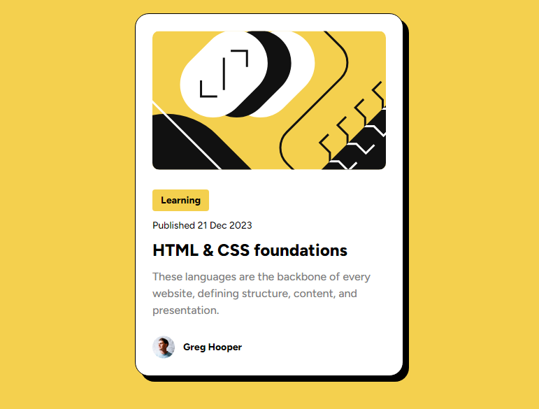

# Frontend Mentor: solución de componentes de Card

Esta es una solución a https://www.frontendmentor.io/challenges/blog-preview-card-ckPaj01IcS

### Enlaces

- URL de la solución: [Enlace](https://dkvyotu.github.io/FrontendMentor-N-2/)

### Construido con

- HTML5
- Propiedades personalizadas de CSS  

## Autor

- Sitio web - [Mi Web](https://codedevweb.com/) (Aun en Construccion)
- Mentor de frontend - [@DKVyotu](https://www.frontendmentor.io/profile/DKVyotu)
- Twitter - [@DKVyotu](https://x.com/DKVyotu)

